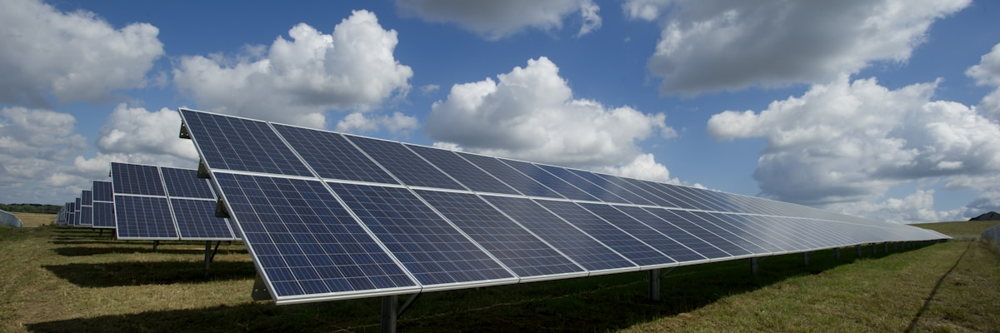
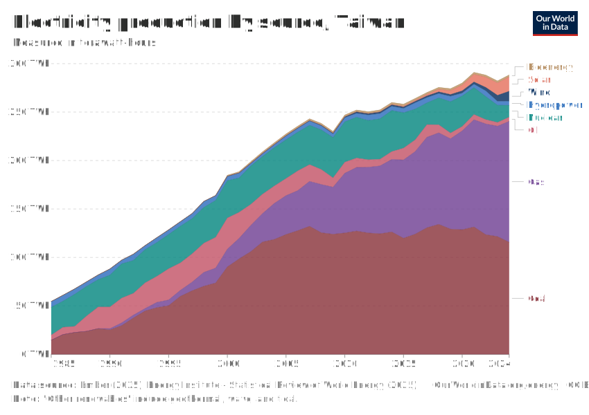
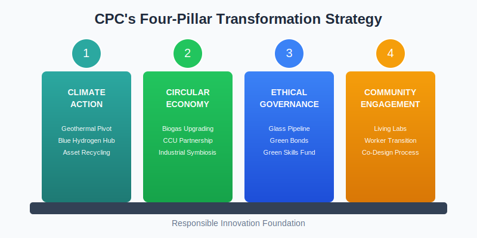
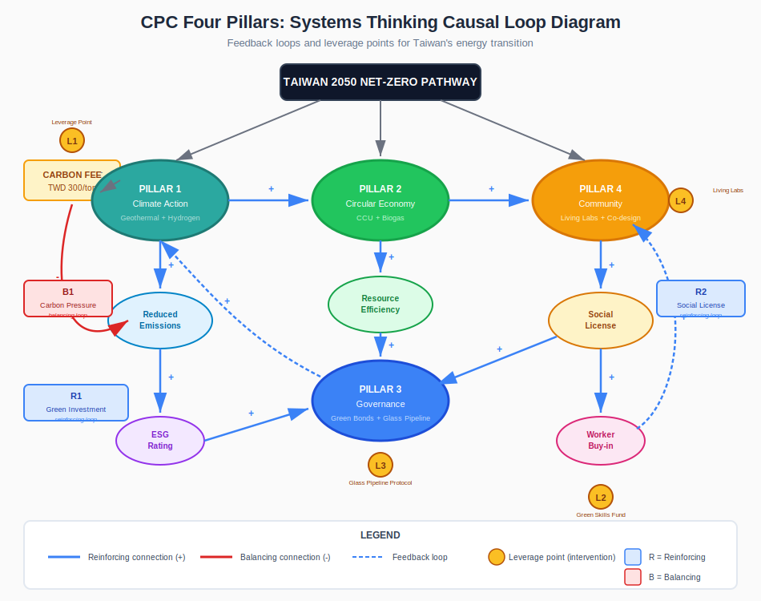
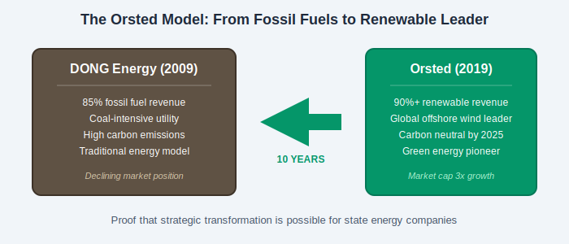

# [The Energy Paradox: Why CPC's Survival Depends on Embracing the Transition It Fears](https://sustainable-advocate.github.io)

*This blog is published online to inspire wider impact and action. By a student from University of Birmingham Business School.*

**A Wake-Up Call for Taiwan's Energy Giant**

*Image: The renewable energy landscape that Taiwan is racing toward. Source: Unsplash*

---

## The Titan Under Pressure

Imagine controlling 78% of a nation's fuel market, only to watch that dominance become your biggest liability. That's exactly where CPC Corporation finds itself today.

Taiwan's state-owned energy giant runs 2,000 service stations and controls everything from oil exploration to retail distribution.[1] For decades, this vertical integration was a competitive advantage. Now? It's a structural vulnerability in a nation racing toward net-zero.

Taiwan isn't just talking about climate action anymore. It's law. The Climate Change Response Act kicked in on 15 February 2023, establishing mandatory [carbon pricing](https://unfccc.int/topics/introduction-to-climate-finance) for major emitters.[4] Carbon fees started on 1 January 2025, with companies facing their first payment obligations in May 2026.[3][5] Taiwan became the 18th nation globally to enshrine net-zero targets in legislation.[6]

**Table 1: Taiwan's Energy Transition Targets**

| Metric | 2025 Target | 2050 Target |
|--------|-------------|-------------|
| Renewable Energy | 20% | 60 to 70% |
| Hydrogen | N/A | 9 to 12% |
| Fossil Fuels (LNG) | 50% | 20 to 27% |
| Carbon Fee Rate | TWD 300/ton | Escalating |

*Sources: Taiwan 2050 Net-Zero Pathway[7]; Taiwan Ministry of Environment[3]*

*Figure 1: Taiwan's electricity generation by source. Data: Our World in Data (CC-BY)*

But regulatory pressure is only part of the story. CPC is also facing a legitimacy crisis.

The October 2022 Dalin refinery explosion traumatised the surrounding community. It was yet another incident in decades of industrial accidents.[9] It's a symptom of a company that's been operating on the "Decide-Announce-Defend" model: build first, deal with community concerns later. That approach isn't working anymore.

*Figure 2: The October 2022 Dalin refinery explosion. Decades of industrial accidents have eroded CPC's social license. Source: Focus Taiwan[9]*

And then there's the corruption investigation. In December 2025, prosecutors launched a probe into CPC's Third LNG Terminal project, with alleged irregularities inflating costs from NT$9.4 billion to NT$25.3 billion.[10]

Here's what makes this urgent: CPC emits 6.38 metric tons of CO₂e for every NT$1 million in revenue.[1] With carbon fees now in effect, that's a massive forward financial liability. Add to this Taiwan's 97.4% energy import dependency,[8] and you start to see why transformation isn't optional. It's survival.

---

## What is Responsible Innovation, and Why Does CPC Need It?

So what exactly is Responsible Innovation? Think of it as "taking care of the future through collective stewardship of science and innovation in the present."[12]

Unlike traditional Corporate Social Responsibility, which often means compensating for harm after the fact, Responsible Innovation is forward-looking. It's about designing your strategy around societal values before problems emerge, not after.

Researchers have identified four dimensions that matter here. And they map perfectly onto CPC's vulnerabilities:[12]

**Anticipation** means seeing risks before they hit you. Carbon pricing is creating financial liabilities right now. CPC can't keep defending aging refinery infrastructure. It needs to anticipate which assets will become obsolete and move capital accordingly.

**Reflexivity** is about confronting your own assumptions. CPC's opacity and risk-averse engineering culture enabled both the corruption scandal and the safety failures. Real reflexivity means admitting: what we've been doing isn't working.

**Inclusion** means actually co-designing solutions with communities and workers, not imposing infrastructure and hoping for the best. The Dalin explosion happened in a community that was never genuinely consulted. That has to change.

**Responsiveness** is about adapting when stakeholders raise concerns. Not defending pre-determined plans, but actually integrating feedback into decisions.

When you get these four dimensions right, something interesting happens: you align the Triple Bottom Line. Economic viability (by anticipating asset devaluation). Social alignment (through genuine community partnership). Environmental leadership (by actively advancing Taiwan's 2050 Net-Zero Pathway).[2][7]

---

## The Four Pillars: A Roadmap for Transformation

*Figure 3: The Four Pillars of CPC's Responsible Innovation Strategy*

*Figure 4: Systems Thinking Analysis showing how the four pillars interconnect through reinforcing loops (R1, R2) and balancing loops (B1), with leverage points (L1-L4) for strategic intervention*

### Pillar 1: Climate Action & Net-Zero Transition *([SDG 7](https://sdgs.un.org/goals/goal7): Affordable and Clean Energy; [SDG 13](https://sdgs.un.org/goals/goal13): Climate Action)*

Incremental efficiency improvements won't cut it anymore. CPC needs a fundamental asset pivot.

There's a playbook for this: Ørsted. The Danish company (formerly DONG Energy) went from coal-intensive utility to global renewable energy leader in under a decade. How? Ruthless divestment decisions.[14]

CPC should do something similar: gradually divest high-carbon petrochemical units and redeploy that capital toward Taiwan's geothermal energy revolution. Here's the opportunity: Taiwan's 2050 Net-Zero Pathway explicitly prioritises geothermal as base-load renewable energy.[7] And CPC already has the drilling expertise. The CPC-Taipower partnership has already produced Taipower's Renze Geothermal Power Plant (operational October 2023) and CPC's Yilan Tuchang project (4 MW capacity, expected 2025).[15]

What about that controversial Third LNG Terminal? Reframe it as a future Blue Hydrogen Hub for heavy industry. Turn stranded infrastructure into critical hydrogen supply for Taiwan's decarbonisation.[13]

**Government Support & Cost Feasibility:** Taiwan's Bureau of Energy allocated NT$5.67 billion (2024-2030) for geothermal development under the Renewable Energy Development Act. The Feed-in Tariff for geothermal (NT$5.1956/kWh) exceeds solar rates (NT$4.0-4.5/kWh), providing strong investment incentives.[7] CPC's existing drilling expertise reduces capital costs by an estimated 15 to 20% versus new market entrants, a critical competitive advantage that makes this pivot economically viable.

### Pillar 2: Circular Thinking & Regenerative Models *([SDG 12](https://sdgs.un.org/goals/goal12): Responsible Consumption and Production)*

The old model is linear: extract, refine, waste. The new model? Symbiotic systems where waste becomes resource.

Imagine co-locating Biogas Upgrading Units at CPC fuel stations, converting local agricultural waste into renewable natural gas.[16] Or scaling Carbon Capture and Utilisation (CCU) by partnering with [China Steel Corporation](https://www.csc.com.tw/csc_e/) to capture refinery CO₂ emissions and convert them into commercial products.[1]

That's how you turn your largest environmental liability into an economic asset.

### Pillar 3: Governance & Ethical Leadership *([SDG 16](https://sdgs.un.org/goals/goal16): Peace, Justice and Strong Institutions)*

Here's an irony: CPC's state-owned status, often seen as bureaucratic deadweight, could actually be a strategic asset.

Unlike private firms chasing quarterly earnings, CPC has access to patient capital. It can leverage long-term government support to absorb the initial risks of scaling Taiwan's hydrogen infrastructure.[17]

But what about that corruption scandal? Address it head-on with a "Glass Pipeline" Protocol: a blockchain-secured ledger for all green infrastructure procurement. Every bid, every contract, immutably recorded.[18]

Then use Green Bonds to fund geothermal and hydrogen projects at lower interest rates. And establish a "Green Skills Fund" to retrain workers in geothermal drilling and hydrogen maintenance.[19][20]

### Pillar 4: Community Engagement & Storytelling *([SDG 8](https://sdgs.un.org/goals/goal8): Decent Work; [SDG 11](https://sdgs.un.org/goals/goal11): Sustainable Cities)*

This is where CPC has to rebuild trust. And that means addressing conflict directly, not hoping it goes away.

**Managing Community Conflict:** Transform safety buffer zones around Dalin Refinery into "Energy Transition Living Labs," partnering with local universities to let residents co-design green spaces and renewable pilots.[9] Back this with formal community advisory boards and transparent grievance procedures.

**Managing Worker Conflict:** Address workforce fears directly with a "Drilling for the Future" campaign that celebrates CPC drillers as geothermal pioneers. The message: your expertise is exactly what Taiwan's geothermal revolution needs.[20]

**Storytelling:** Launch "Taiwan's Energy Pioneers" documenting workers transitioning to geothermal roles, transforming CPC from villain to protagonist in Taiwan's energy story.

**Table 2: CPC's Four-Pillar Transformation Strategy**

| Pillar | Challenge | Action | Outcome |
|--------|-----------|--------|---------|
| Climate Action | Carbon liability | Geothermal pivot, Blue Hydrogen Hub | Net-zero alignment |
| Circular Economy | Waste/emissions | Biogas units, CCU partnership | Resource efficiency |
| Governance | Corruption scandal | Blockchain procurement, Green Bonds | Transparency |
| Community | Conflict/distrust | Living Labs, co-design, worker retraining | Social license |

**Table 3: ESG & SDG Alignment Matrix**

| Pillar | ESG Dimension | Primary SDGs | Key Performance Indicators |
|--------|---------------|--------------|----------------------------|
| Climate Action | **E** - Environmental | [SDG 7](https://sdgs.un.org/goals/goal7), [SDG 13](https://sdgs.un.org/goals/goal13) | Emissions reduction (tCO₂e), renewable capacity (MW) |
| Circular Economy | **E** - Environmental | [SDG 12](https://sdgs.un.org/goals/goal12), [SDG 9](https://sdgs.un.org/goals/goal9) | Waste diverted (%), resource efficiency ratio |
| Governance | **G** - Governance | [SDG 16](https://sdgs.un.org/goals/goal16), [SDG 8](https://sdgs.un.org/goals/goal8) | Transparency score, procurement audit compliance |
| Community | **S** - Social | [SDG 8](https://sdgs.un.org/goals/goal8), [SDG 11](https://sdgs.un.org/goals/goal11) | Jobs transitioned, community trust index |

*This matrix demonstrates how CPC's four-pillar strategy systematically addresses all ESG dimensions while advancing multiple UN Sustainable Development Goals.*

---

## What Should CPC Actually Do?

Strategy is one thing. Execution is another. Here are four concrete moves:

**Digital Twin Technology:** Install virtual replica monitoring at the Dalin Refinery. Use real-time sensor data to predict equipment failure before explosions happen. You prevent safety disasters and cut maintenance costs by 25%.[21]

**Industrial Symbiosis Networks:** Model this on Denmark's Kalundborg Symbiosis. CPC's refinery waste heat and captured CO₂ become feedstock for steel and cement production. One company's waste becomes another's resource.[22]

**Hydrogen Infrastructure Partnerships:** CPC can't build hydrogen expertise alone. Partner with international hydrogen technology providers to convert LNG terminals into Blue Hydrogen Hubs. Leverage global expertise.[13]

**Just Transition Financing:** Combine Green Bonds with "Green Skills Fund" worker retraining. This ensures decarbonisation doesn't create social backlash while accessing ESG-conscious capital at preferential rates.[19][20]

---

## Can This Really Work?

Let's be honest about the barriers:

**Table 4: Implementation Barriers, Solutions & Timeline**

| Barrier | Severity | Solution | Implementation Timeline |
|---------|----------|----------|------------------------|
| Regulatory rigidities (hydrogen as "dangerous gas") | HIGH | Regulatory sandbox designation | 2025-2026: Lobby government; 2027: Pilot operations |
| Organisational culture (reliability over innovation) | HIGH | "Drilling for the Future" identity campaign | 2025 Q1: Campaign launch; 2026: Full organisational rollout |
| Financial viability (short-term cost gaps) | MEDIUM | Green Bonds + blended finance model | 2025: First green bond issuance (NT$10B target) |
| Stranded asset risk | HIGH | Capital recycling strategy | 2025-2030: Phased petrochemical unit divestment |
| Skill gaps (petroleum-centric workforce) | MEDIUM | Green Skills Fund + Taipower partnership | 2025-2027: Retrain 2,000 workers annually |

*Sources: DIGITIMES[23]; Sovacool & Griffiths[24]; Taiwan Bureau of Energy[7]*

If CPC gets this right, it de-risks Taiwan's entire energy transition, addressing the 97.4% energy import dependency while advancing SDG 7, SDG 8, and SDG 13.[7][8]

---

## The Bottom Line

*Figure 5: The Ørsted Model - proof that strategic transformation is achievable for state energy companies*

CPC's story doesn't have to end like Kodak or Blockbuster. It can end like Ørsted: a company that saw the future clearly and emerged as a global leader in the transition economy.[14]

**CPC's survival depends on embracing the transition it was built to resist.** Taiwan will transition to clean energy. That's settled law. The only question is whether CPC will lead it or be left behind.

---

## References

[1] CPC Corporation (2025) *2024 Sustainability Report: Energy Conservation & Carbon Reduction*. Taipei: CPC Corporation. Available at: https://www.cpc.com.tw (Accessed: 4 December 2025).

[2] Reset Carbon (2024) 'Taiwan Carbon Fee Rollout in 2025: Key Insights for Companies', *Reset Carbon*, 8 April. Available at: https://resetcarbon.com (Accessed: 7 December 2025).

[3] Taiwan Ministry of Environment (2024) 'Fee-Charging Rates of Carbon Fees', *Taiwan Ministry of Environment*, 21 October. Available at: https://www.moenv.gov.tw/en/news/press-releases/31552.html (Accessed: 7 December 2025).

[4] Global Taiwan Institute (2023) 'On the Path to Net-Zero: Will Taiwan Reach Its Goal?', *Global Taiwan Institute*, 22 August. Available at: https://globaltaiwan.org (Accessed: 7 December 2025).

[5] Chambers Global Practice Guides (2025) 'Climate Change Regulation 2025 - Taiwan'. Available at: https://practiceguides.chambers.com (Accessed: 7 December 2025).

[6] Global Taiwan Institute (2023) 'On the Path to Net-Zero: Will Taiwan Reach Its Goal?', *Global Taiwan Institute*, 22 August. Available at: https://globaltaiwan.org (Accessed: 7 December 2025).

[7] Climate Laws & Regulations (2022) 'Pathway to Net-Zero Emissions in 2050', *Climate Laws & Regulations*. Available at: https://climate-laws.org (Accessed: 7 December 2025).

[8] U.S. Department of Commerce International Trade Administration (2024) 'Taiwan - Electric Power Equipment (ELP) and Energy'. Available at: https://www.trade.gov (Accessed: 7 December 2025).

[9] Focus Taiwan (2022) 'Large explosion in Taiwan's CPC Dalin oil refinery, no injuries', *Focus Taiwan*, 27 October. Available at: https://focustaiwan.tw (Accessed: 4 December 2025).

[10] Focus Taiwan (2025) 'Prosecutors probe alleged corruption in CPC's 3rd LNG Terminal project', *Focus Taiwan*, 3 December. Available at: https://focustaiwan.tw (Accessed: 4 December 2025).

[11] Taiwan Net-Zero Emissions Association (2025) 'Taiwan to Pilot ETS in 2026, Dual Carbon Pricing System with ETS Expected by 2027', *Taiwan Net-Zero Emissions Association*, 9 July. Available at: https://www.tnzea.org.tw (Accessed: 7 December 2025).

[12] Stilgoe, J., Owen, R. and Macnaghten, P. (2013) 'Developing a framework for responsible innovation', *Research Policy*, 42(9), pp. 1568–1580.

[13] EODev and Nexcellent Energy (2025) 'EODev and Nexcellent Energy join forces in Taiwan', *EODev News*, 14 October. Available at: https://www.eo-dev.com (Accessed: 7 December 2025).

[14] McKinsey & Company (2020) 'Ørsted's renewable-energy transformation', *McKinsey Sustainability*, 9 July. Available at: https://www.mckinsey.com (Accessed: 5 December 2025).

[15] Taipower (2023) 'First Achievements of the Geothermal Power Generation National Team', *Taipower*, 17 December. Available at: https://www.taipower.com.tw (Accessed: 7 December 2025).

[16] Taisugar (2024) *Circular Economy & Biogas Energy Report*. Tainan: Taiwan Sugar Corporation.

[17] RVO (2022) *Hydrogen Developments in Taiwan*. The Hague: Netherlands Enterprise Agency.

[18] SciRes Journals (2025) 'Blockchain for transparent and secure supply chain management in renewable energy', *International Journal of Sustainability*, 12 January. Available at: https://sciresjournals.com (Accessed: 7 December 2025).

[19] ESG News (2025) 'Taiwan Aligns Bond Rules With Global Standards for Blue and Biodiversity Finance', *ESG News*, 24 November. Available at: https://esgnews.com (Accessed: 7 December 2025).

[20] IndustriALL (2024) 'Energy sector unions in Southeast Asia drive forward Just Transition strategies', *IndustriALL News*, 25 October. Available at: https://www.industriall-union.org (Accessed: 7 December 2025).

[21] IBM (2023) 'Digital Twin for the Oil & Gas Industry', *IBM Think Topics*, 25 July. Available at: https://www.ibm.com/think/topics/digital-twin-for-oil-gas (Accessed: 7 December 2025).

[22] ASUENE (2025) 'Industrial Symbiosis: Turning Waste into Value in Industrial Networks', *ASUENE Blog*, 13 August. Available at: https://asuene.com (Accessed: 7 December 2025).

[23] DIGITIMES (2024) 'Hydrogen hurdles: Taiwan firms seek government support', *DIGITIMES Asia*, 22 April. Available at: https://www.digitimes.com (Accessed: 7 December 2025).

[24] Sovacool, B.K. and Griffiths, S. (2020) 'Culture and low-carbon energy transitions', *Nature Energy*, 5, pp. 685–693.

---
